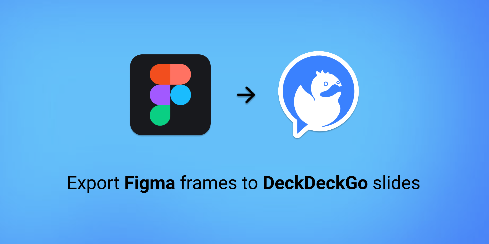
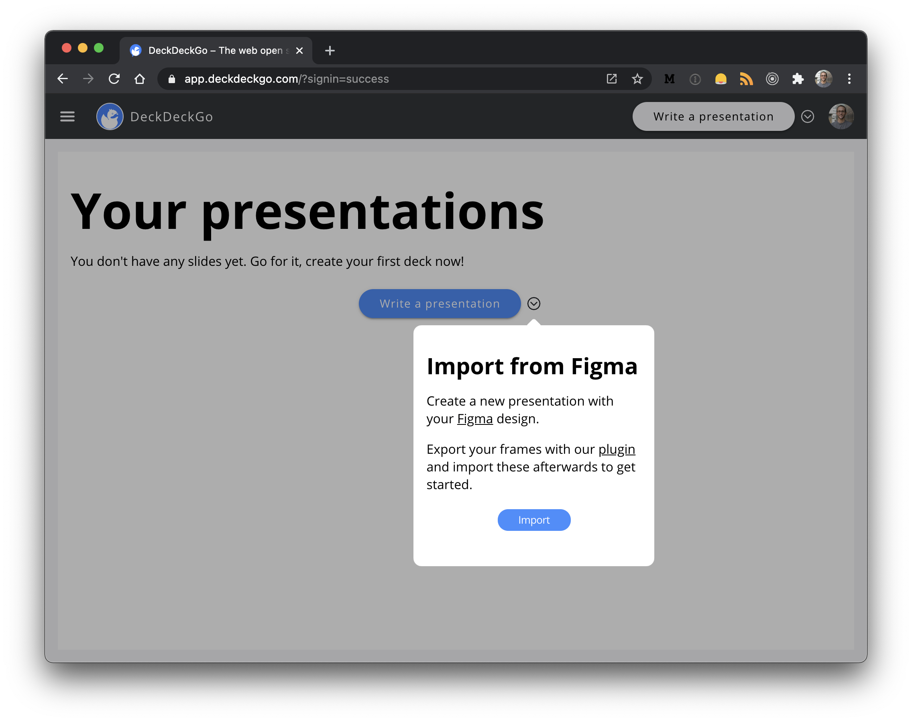

# figma-deckdeckgo-plugin

Export [Figma] frames to [DeckDeckGo] slides.

<div align="center">
    

    <br/>

[](https://www.figma.com/community/plugin/950777256486678678/Figma-to-DeckDeckGo)
[](https://github.com/deckgo/deckdeckgo/releases/latest)
</div>

## Table of contents

- [Getting Started](#getting-started)
- [How to?](#how-to)
- [Design Guidelines](#design-guidelines)
- [Development](#development)
- [License](#license)

## Getting Started

[DeckDeckGo] is an open source web editor for presentations.

This plugin, once installed in [Figma], can be used to export frames to [DeckDeckGo] slides. The assets are exported as `webp` images and optionally, texts are extracted to make these editable in the editor.

## How to?

- Use the [plugin] to export your frames
- Download the resulting asset as zip file
- Go to the DeckDeckGo [editor](https://app.deckdeckgo.com)
- Import the data to create a new deck

<div align="center">
    
</div>

## Design Guidelines

There are currently no check on the frame ratio. Nevertheless, we suggest the use of a 16/9 ratio.

It is also worth to notice that [DeckDeckGo] supports currently only a few fonts and, one family per decks.

## Development

To build this plugin locally:

```
git clone https://github.com/deckgo/figma-deckdeckgo-plugin
cd figma-deckdeckgo-plugin
npm ci
npm run build
```

## License

This plugin is released under the [GNU Affero General Public License](GNU-AGPL-3.0). Copyright [David Dal Busco](mailto:david.dalbusco@outlook.com) and [Nicolas Mattia](mailto:nicolas@nmattia.com), Zürich, Switzerland. See [COPYING](./COPYING) for more details.

[deckdeckgo]: https://deckdeckgo.com
[figma]: https://figma.com
[plugin]: https://www.figma.com/community/plugin/950777256486678678/Figma-to-DeckDeckGo
